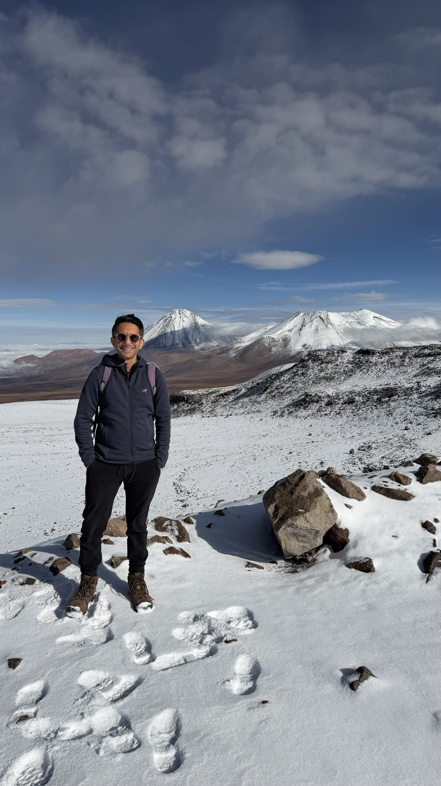
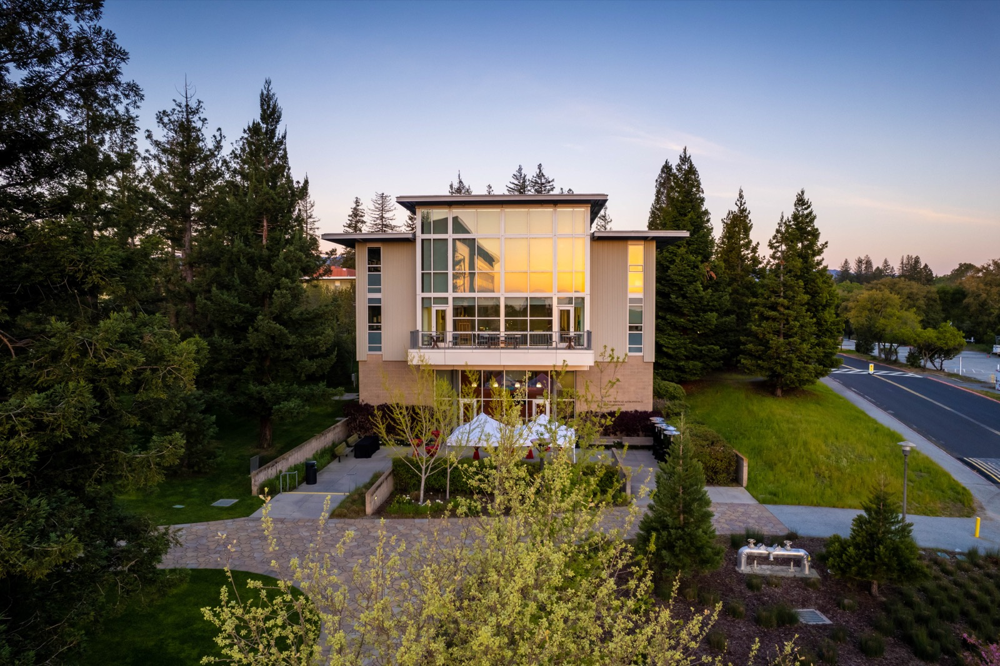

I am an observational cosmologist and experimental physicist. My work spans the whole
measurement chain, from superconducting devices fabricated on silicon wafers, through the
cryogenic instruments that hold them and the electronics that read them out, to the
cosmological inference drawn from the resulting maps.

I received my PhD in particle astrophysics from Caltech in 2012, working on direct detection
of WIMP dark matter with the CDMS-II experiment. I then shifted my effort to searching for
inflation with the cosmic microwave background. I was a postdoctoral scholar at Stanford
through 2015 before being appointed a Wolfgang Panofsky Fellow at SLAC National Accelerator
Laboratory. In 2017 I received a Department of Energy Office of Science Early Career Award to
develop superconducting multiplexing techniques for next-generation CMB cameras. I was
appointed a Lead Scientist at SLAC in 2020 and Associate Professor of Particle Physics and
Astrophysics at Stanford and SLAC in 2023.

{fig-alt="A person standing on a snow-dusted high-altitude plateau with volcanic peaks behind."}

## Current roles

::: {.roles}
- Head, CMB Department, Fundamental Physics Directorate, SLAC
  [2019–present]{.span}
- Associate Professor of Particle Physics and Astrophysics, KIPAC, SLAC and Stanford
  [2023–present]{.span}
- DOE Principal Investigator, BICEP Array Upgrade Project
  [2025–present]{.span}
- SLAC Principal Investigator and Readout L2 manager, SPT-3G+
  [2025–present]{.span}
- Co-Investigator, Advanced Simons Observatory (NSF), leading the SLAC scope
  [2023–present]{.span}
- Photon Sensors project lead, Sensors for Entanglement thrust, Q-NEXT
  [2025–2030]{.span}
- Principal Investigator and user, SLAC Detector Microfabrication Facility; member of its
  process review committee
  [2026–present]{.span}
- Member, Program Committee, Applied Superconductivity Conference
  [2026]{.span}
:::

From 2022 to 2025 I directed the project that designed and built SLAC's Detector
Microfabrication Facility. The facility is now in operations, and I work in it as a principal
investigator, fabricating devices for cosmology and quantum sensing.

From 2019 until the project's cancellation in 2025, I was the level-2 science lead for
detector readout on CMB-S4.

## Education

::: {.roles}
- PhD, Particle Astrophysics, California Institute of Technology. *A Dark-Matter Search Using
  The Final CDMS II Dataset And A Novel Detector Of Surface Radiocontamination*, advisor
  Sunil Golwala
  [2012]{.span}
- MS, Physics, California Institute of Technology
  [2008]{.span}
- BS, Aerospace Engineering, University of Southern California
  [2005]{.span}
:::

## Contact

{fig-alt="A modern three-story building with large windows, surrounded by redwoods and lawn at dusk."}

2575 Sand Hill Road, Menlo Park, CA 94025

[zeesh@slac.stanford.edu](mailto:zeesh@slac.stanford.edu)

::: {.linkrow}
[CV](Zeeshan_Ahmed_CV_and_Publications.pdf) [·]{.sep}
[ORCID](https://orcid.org/0000-0002-9957-448X) [·]{.sep}
[Google Scholar](https://scholar.google.com/citations?user=hXDuulsAAAAJ&hl=en) [·]{.sep}
[INSPIRE-HEP](https://inspirehep.net/authors/1054828)
:::
