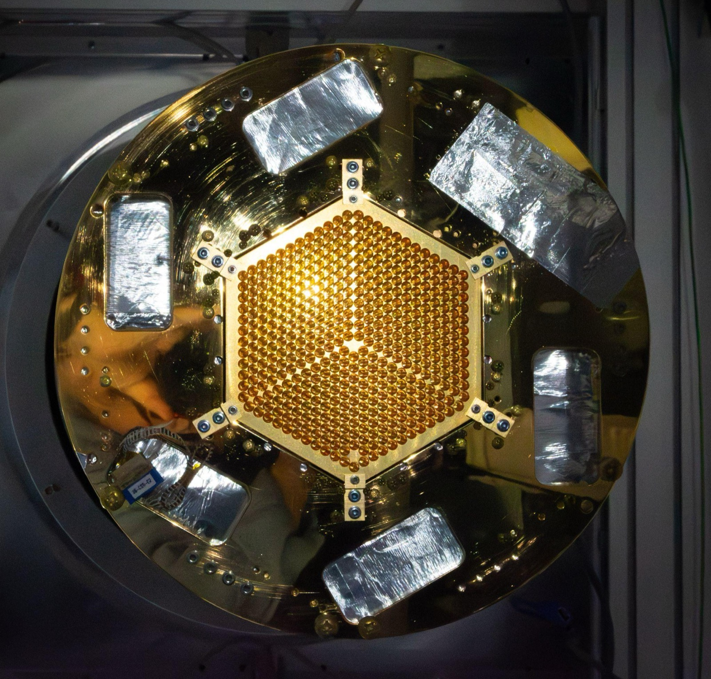
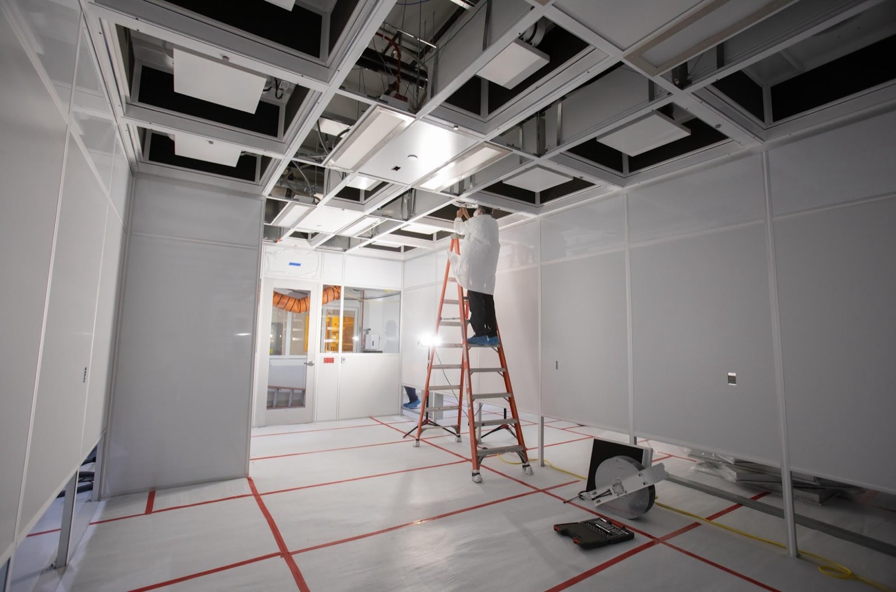
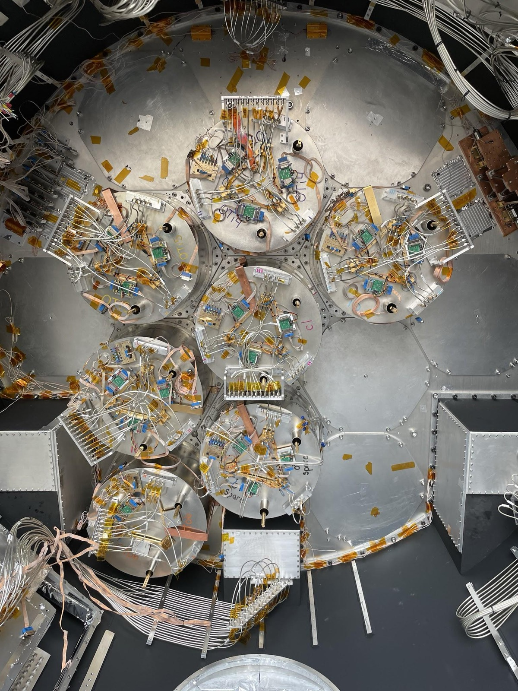

At a few hundred channels, an instrument is limited by how good its best devices are. At
tens of thousands, it is limited by how alike they are. A transition-edge sensor whose
critical temperature sits 10 mK from its neighbours needs a different bias point. A resonator
whose frequency lands 200 kHz from where the design put it collides with the channel next to
it and both are lost. Neither failure shows up when you measure one device carefully; both
decide whether a multiplexed array reads out at all.

So the quantities that matter are distributions rather than single-device figures of merit:
the spread in transition temperature across a wafer, the scatter in resonator frequency
placement against design, and the yield that survives both. Fabrication is where those
distributions are set, which makes it part of the physics rather than a service supplied to
it.

{fig-alt="A gold-plated circular cryostat stage viewed head-on, with a hexagonal detector array of hundreds of small circular apertures at its centre, surrounded by foil-wrapped components."}

## The Detector Microfabrication Facility

From 2022 to 2025 I directed the project that designed and built SLAC's Detector
Microfabrication Facility. The facility is now in operations, and I work in it as a principal
investigator, fabricating devices for cosmology and quantum sensing. I also sit on its
process review committee.

It is a $49M, 5,500 square foot Class-100 cleanroom built for 150 mm wafers, with a process
line covering niobium, aluminium, and silicon oxides and nitrides. That materials set is
chosen: it is what superconducting resonators, transition-edge sensors and nanowire detectors
are actually made from, and having the full line in one place means a design change can be
tested in weeks rather than negotiated across institutions over months.

{fig-alt="An empty cleanroom under construction, with white wall panels, an open ceiling grid and a technician on a stepladder installing a ceiling filter."}

::: {.todo}
**TODO.** Add the canonical SLAC URL for the Detector Microfabrication Facility once it
exists, and replace the construction photograph with one of the facility in operation, or
with a wafer.
:::

## What we make there

**Superconducting nanowire single-photon detectors** for the Q-NEXT photon sensors project,
aimed at entanglement distribution: high detection efficiency and low timing jitter at
telecom wavelengths, where the requirement is not a single good detector but many detectors
whose timing behaviour matches.

**High kinetic inductance thin films** for parametric amplification, sensing, and quantum
information, under an LDRD program running 2027 to 2029. The same film platform supports
low-threshold detectors for dark matter and rare-event searches, where the relevant figure of
merit is how little energy can be detected at all.

**Test structures for the multiplexing program**, where the object of study is frequency
placement itself. Controlling where each resonator lands across a wafer, and understanding
what drives the scatter, is what decides whether a multiplexer is usable or collision-riddled
at the channel counts the [readout](smurf.qmd) can otherwise support.

{fig-alt="Overhead view of a cryogenic focal plane assembly with seven circular modules, densely populated with small circuit components, Kapton tape and wiring harnesses."}
