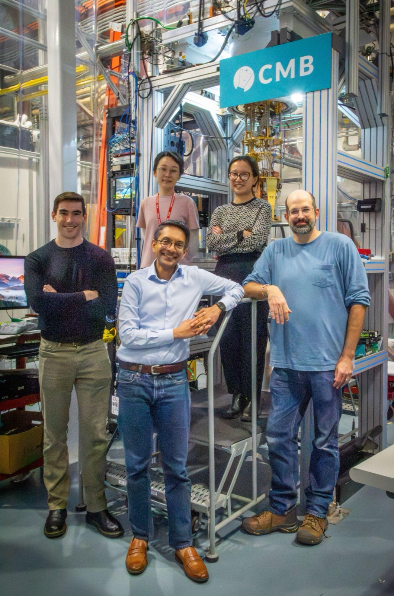
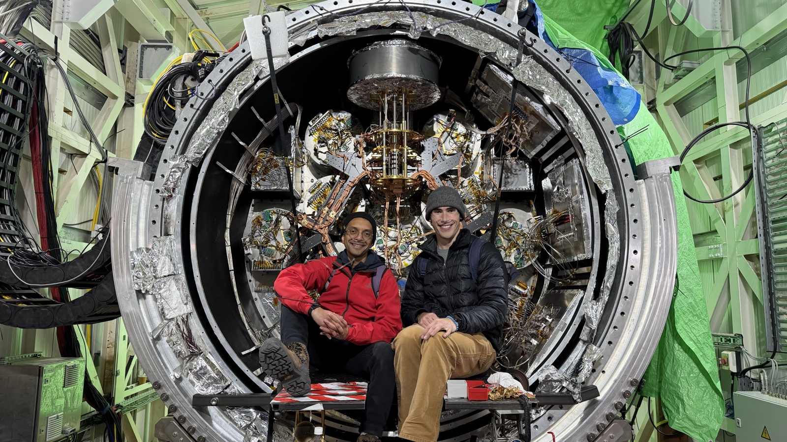

{fig-alt="Five people standing and smiling in front of a laboratory cryostat rack with a sign reading CMB."}

{fig-alt="Two people seated in front of a large open cryostat packed with foil-wrapped optics tubes and wiring."}

## Graduate students

::: {.people}
- [Brianna Cantrall]{.who} [· Stanford · 2024–present]{.meta}
  [Cosmic inflation search with BICEP Array; characterization of Galactic
  foregrounds.]{.what}
- [Thomas Satterthwaite]{.who} [· Stanford · 2023–present]{.meta}
  [CMB lensing reconstruction with the Simons Observatory; commissioning of the SO camera
  readout system.]{.what}
:::

## Postdoctoral researchers and fellows

::: {.people}
- [Jia 'Frank' Qu]{.who} [· Stanford · 2023–present · Einstein Fellow, 2026–present]{.meta}
  [CMB lensing reconstruction with the Simons Observatory.]{.what}
- [Carlos Sierra]{.who} [· KIPAC Fellow, Stanford · 2024–present]{.meta}
  [Millimeter-wave line intensity mapping simulations and experiment design.]{.what}
- [Tristan Pinsonneault-Marotte]{.who} [· Stanford · 2023–present]{.meta}
  [Simons Observatory readout subsystem; CMB and large-scale structure
  cross-correlations.]{.what}
- [Rui 'Ray' Shi]{.who} [· Stanford · 2025–present]{.meta}
  [BICEP Array Galactic foreground studies; time-division readout electronics.]{.what}
:::

## Research scientists

::: {.people}
- [Cheng Zhang]{.who} [· Stanford · 2025–present]{.meta}
  [Design, modeling and fabrication of superconducting and qubit-based sensors.]{.what}
- [Dominic Beck]{.who} [· Stanford · 2025–present]{.meta}
  [AI techniques for CMB data quality and data processing pipeline speedup.]{.what}
:::

## Staff scientists

::: {.people}
- [Emmanuel Schaan]{.who} [· SLAC · 2022–present]{.meta}
  [Simons Observatory large-scale structure studies; Rubin.]{.what}
- [Shawn Henderson]{.who} [· SLAC · 2017–present]{.meta}
  [CMB detector readout systems; Simons Observatory, BICEP.]{.what}
:::

## Alumni

::: {.people}
- [Cyndia Yu]{.who} [· PhD, 2023 · now at Rigetti Computing]{.meta}
  [*Large-Scale Observations of the Cosmic Microwave Background.*]{.what}
- [Federico Bianchini]{.who} [· postdoc, 2020–2024 · now at Woven by Toyota]{.meta}
  [CMB inflation foreground cleaning.]{.what}
- [David Goldfinger]{.who} [· postdoc, 2022–2023 · now at MIT Lincoln Laboratory]{.meta}
  [CMB-S4 detector readout system development.]{.what}
- [Ari Cukierman]{.who} [· postdoc, 2018–2022 · now a postdoctoral scholar at Caltech]{.meta}
  [Ultralight axion searches with CMB polarization; the BICEP/Keck microwave multiplexing
  demonstrator.]{.what}
- [Ed Young]{.who} [· postdoc, 2018–2021 · now Head of Research at Charm Industrial]{.meta}
  [X-ray calorimetry with microwave multiplexing.]{.what}
- [Sarah Kernasovskiy]{.who} [· postdoc, 2016–2018]{.meta}
  [Development of SMuRF.]{.what}
- [Max Silva-Feaver]{.who} [· PhD, UC San Diego · 2016–2023 · now Mossman Fellow at Yale]{.meta}
  [Microwave multiplexing for the Simons Observatory.]{.what}
- [Stephen Kuenstner]{.who} [· PhD, Stanford · 2016–2018]{.meta}
  [Microwave multiplexing development.]{.what}
:::

::: {.todo .content-visible when-profile="draft"}
**TODO.** Two placements are still unconfirmed and therefore omitted: Sarah Kernasovskiy
(a 2017 KIPAC entry says Fitbit; Google is a guess, not a source) and Stephen Kuenstner
(possibly faculty at a liberal arts college; nothing found to confirm it). Supply either and
it goes in.
:::

## Former members now elsewhere

::: {.people}
- [W. L. Kimmy Wu]{.who}
  [Assistant Professor, California Institute of Technology.]{.what}
- [Kirit Karkare]{.who}
  [Assistant Professor, Boston University.]{.what}
- [Josef Frisch]{.who}
  [Senior engineer, Google.]{.what}
:::

## Joining the group

Concrete directions with room in them right now:

- microwave multiplexed readout systematics and how they propagate into CMB lensing
- Galactic foreground characterization for inflation searches
- single-photon detectors for quantum networking
- superconducting device fabrication at the Detector Microfabrication Facility

**Undergraduates.** Through the Stanford undergraduate research programs, or through DOE
SULI.

**Graduate students.** If you have been admitted to Stanford, write to me about a rotation
project.

**Postdocs.** Write to me directly at
[zeesh@slac.stanford.edu](mailto:zeesh@slac.stanford.edu).
