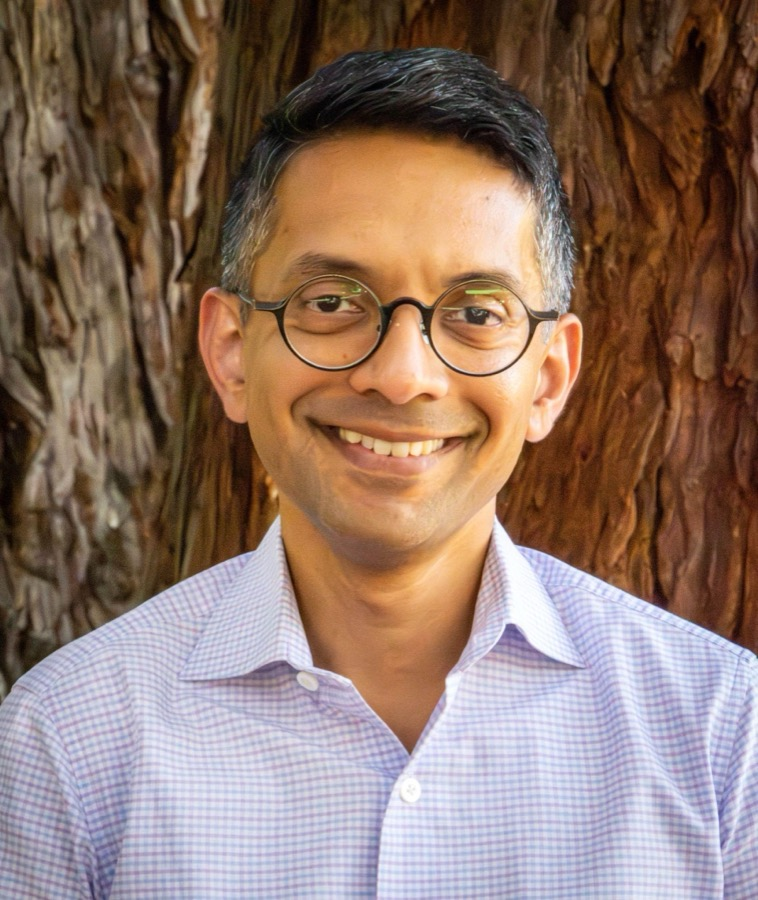

::: {.hero-role}
Associate Professor of Particle Physics and Astrophysics  
[Kavli Institute for Particle Astrophysics and Cosmology, Stanford University and SLAC
National Accelerator Laboratory]{.affil}
:::

::: {.portrait-row}
::: {.portrait}
{alt="Zeeshan Ahmed"}

[Portrait by Lori White]{.credit}
:::

::: {.standfirst}
I build ultra-low-noise superconducting detectors and the readout systems that make them
usable at scale, and I use them to ask what happened in the first instant of the Universe
and how cosmic structure grew afterward.
:::
:::



::: {.caption}
Each dip is one channel. Reading thousands of them on a single coaxial line makes
large detector arrays possible.
:::

I am CMB department head in SLAC's Fundamental Physics Directorate. I lead DOE's BICEP
Array Upgrade Project in collaboration with NSF. I built the detector readout electronics
for the Simons Observatory. I lead the photon sensors project in Q-NEXT's Sensors for
Entanglement thrust.

::: {.linkrow}
[CV](Zeeshan_Ahmed_CV_and_Publications.pdf) [·]{.sep}
[ORCID](https://orcid.org/0000-0002-9957-448X) [·]{.sep}
[Google Scholar](https://scholar.google.com/citations?user=hXDuulsAAAAJ&hl=en) [·]{.sep}
[INSPIRE-HEP](https://inspirehep.net/authors/1054828)
:::

## What I work on

::: {.threads}

::: {.thread}
### [The first instant](inflation.qmd)
Inflation predicts a background of primordial gravitational waves. The South Pole
Observatory, combining BICEP Array and SPT-3G+, is searching for their imprint on
CMB polarization with a target sensitivity of σ(r) = 0.001.
:::

::: {.thread}
### [How structure grew](structure.qmd)
Gravitational lensing of the CMB maps all the matter between us and the last scattering
surface. Additionally, the Sunyaev Zeldovich (SZ) effect tracks the pressure and momentum of electrons.
The Simons Observatory's rich wide-field data helps us map these effects to understand how structure formed.
:::

::: {.thread}
### [Sensing at the quantum limit](smurf.qmd)
Microwave SQUID multiplexing and the SMuRF electronics read out 98,000 superconducting
sensors at once. The same capability now serves quantum networking and dark matter
searches.
:::

:::

## Recent

::: {.dated}
- [August 2026]{.when} [The South Pole Observatory: A Combined Inflation Search Program
  Targeting σ(r) ∼ 0.001 [New Frontiers in Cosmology, A Coruña]{.where}]{.what}
- [July 2026]{.when} [From CMB to Qubits: Shared Frontiers in Superconducting Sensing
  [CECI Workshop on Detector Science, UC Riverside]{.where}]{.what}
- [May 2026]{.when} [SMuRF and SPECTRA: Scalable Warm Electronics for Superconducting Dark
  Matter Sensors [Superconducting Technologies for Dark Matter 2026, Sapienza University of
  Rome]{.where}]{.what}
- [March 2026]{.when} [Updates from the BICEP inflation search program
  [Rencontres de Moriond, Cosmology]{.where}]{.what}
- [September 2025]{.when} [SLAC's Detector Microfabrication Facility completed construction
  and entered operations [Devices for cosmology and quantum sensing are now fabricated
  there]{.where}]{.what}
:::
