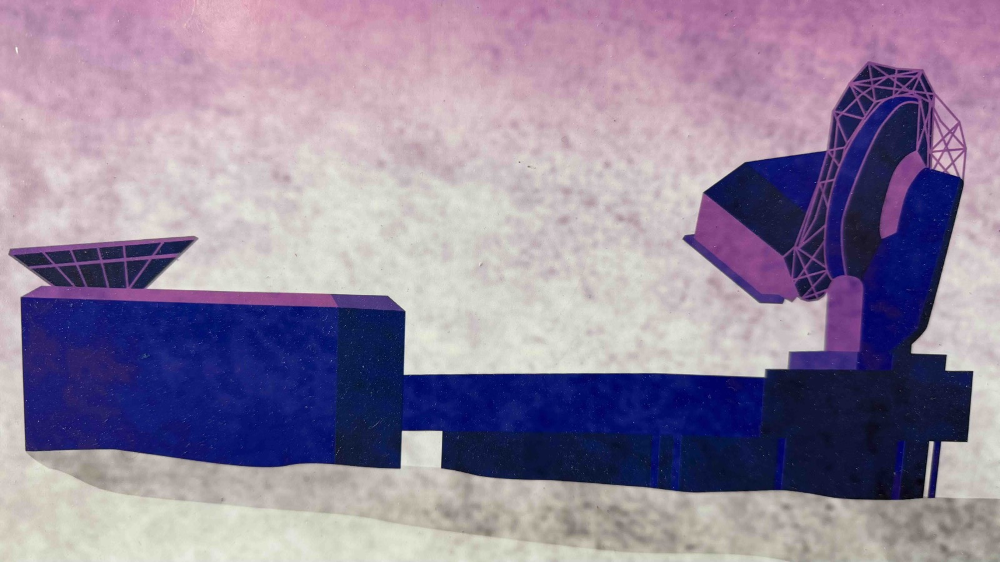
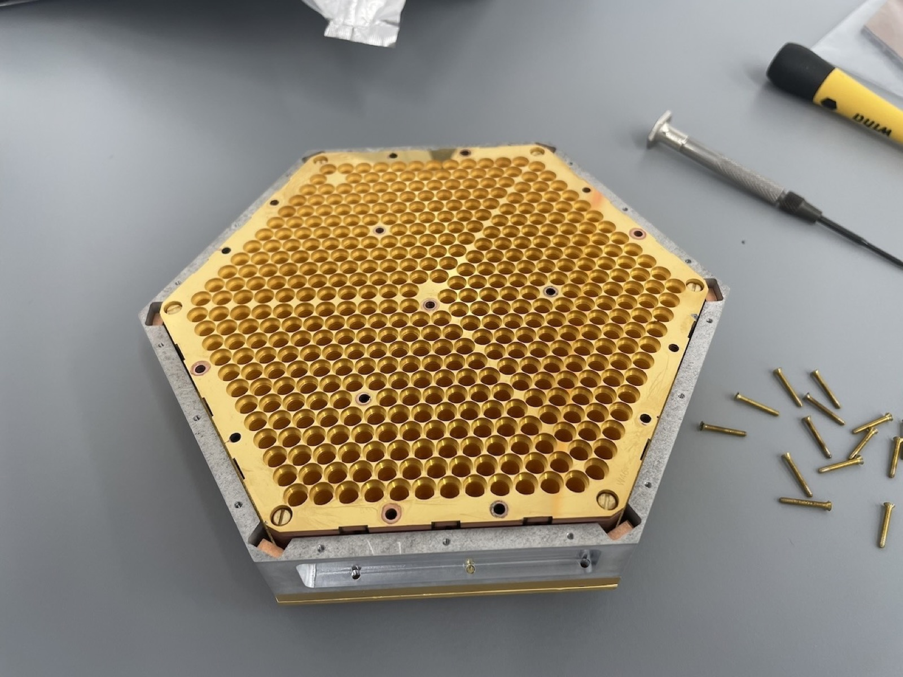

Inflation predicts that the violent expansion of the early Universe left behind a background
of primordial gravitational waves. Those waves would imprint a distinctive curl, a B-mode
pattern, on the polarization of the cosmic microwave background at degree angular scales.
Detecting that pattern would be direct evidence of physics at energies far beyond the reach
of any accelerator.

The signal, if it exists at the level current experiments can reach, is faint enough that
nothing about the measurement is routine. Three things stand between an instrument and an
answer: the raw sensitivity of the detector array, the Galactic dust and synchrotron
emission that shine in polarization along the same line of sight, and the gravitational
lensing that converts the CMB's own E modes into B modes. The South Pole Observatory is
built around attacking all three at once.

## The South Pole Observatory

::: {.marks}
 
:::

The [South Pole Observatory](http://bicepkeck.org) is a coordinated observing and analysis
program of the BICEP and SPT collaborations at the Amundsen-Scott South Pole Research
Station, targeting σ(r) = 0.001 on the tensor-to-scalar ratio. Compact small-aperture BICEP
polarimeters integrate deeply on roughly 1% of the sky to search for the primordial signal,
and to disentangle it from Galactic foregrounds in that field. The 10 meter South Pole
Telescope supplies the high-resolution maps of gravitational lensing used to delens those
B-mode data. Lensing of the CMB by intervening structure converts E-mode polarization into
B modes that would otherwise swamp a primordial signal at this level, so delensing is not a
refinement of the measurement but a requirement of it.

The site does much of the work. The Antarctic plateau is high, cold and exceptionally dry,
and a target field near the South Celestial Pole stays above the horizon continuously, so
one patch of sky can be integrated on for years rather than for the few hours a night a
mid-latitude site allows. The same patch was chosen for unusually low Galactic foreground
emission.

## Current work

I am the DOE principal investigator of the BICEP Array Upgrade Project, populating the
fourth BICEP Array receiver with detector modules before installation and commissioning at
the South Pole. I am also the SLAC principal investigator and Readout L2 manager for
SPT-3G+, leading the microwave SQUID multiplexed readout for a receiver of 24,080
transition-edge sensors at 90 and 150 GHz, planned for installation in early 2029.

Those two roles are the two halves of the same measurement. The BICEP Array receivers
supply the deep, degree-scale polarization data in which a primordial signal would appear.
SPT-3G+ supplies the high-resolution lensing measurement that says how much of the observed
B-mode power is lensing rather than inflation, and lets it be subtracted.

::: {layout-ncol=2}
{fig-alt="Two people on scaffolding beside the four cylindrical BICEP Array receivers, mounted in a blue-skirted ground shield on the Antarctic plateau."}

{fig-alt="Five people standing beside a tall cylindrical cryostat in a laboratory high bay."}
:::

{fig-alt="A gold hexagonal detector module on a bench, its face densely packed with circular feedhorn apertures, with assembly pins and a screwdriver beside it."}

The detector modules that go into the fourth receiver are the ones described on the
[devices page](devices.qmd), and the readout that reads them out at scale is the
[SMuRF platform](smurf.qmd). This program is the reason both of those exist in the form
they do.

## Earlier work in this program

{fig-alt="Several people in polar gear working on the open back of a telescope receiver mounted inside a large reflective ground shield, surrounded by snow."}

As a postdoc, I led the design, construction, testing and deployment of BICEP3, which
delivered ten times the optical throughput of the previous generation of BICEP receivers,
from 2011 to 2015. From 2015 to 2018, as Panofsky Fellow at SLAC, I coordinated BICEP/Keck
science observations and oversaw low-level data reduction, map making and data quality
assurance, work that produced the BK18 dataset and its constraint r(0.05) < 0.036 at 95%
confidence. I also supervised the first published constraints on ultralight axionlike fuzzy
dark matter derived from polarization oscillations in BICEP/Keck data.

{fig-alt="Six sky maps arranged in two columns showing temperature, Q and U polarization signal and noise for a patch of southern sky."}

::: {.todo}
**TODO, drafted text and captions to check.** Two paragraphs here are mine rather than yours and are
written from general knowledge of the program, not from anything you supplied: the one
listing the three obstacles (sensitivity, foregrounds, lensing), and **The site does much of
the work**, on the plateau conditions and the choice of field. Correct or cut them. The
paragraph tying the BICEP Array and SPT-3G+ roles together is also new, though it only
restates the delensing argument above it. The BA4 module caption calls it a prototype,
from the file name; correct it if that is the flight module.
:::
