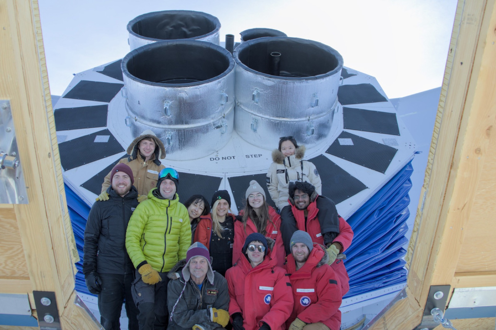
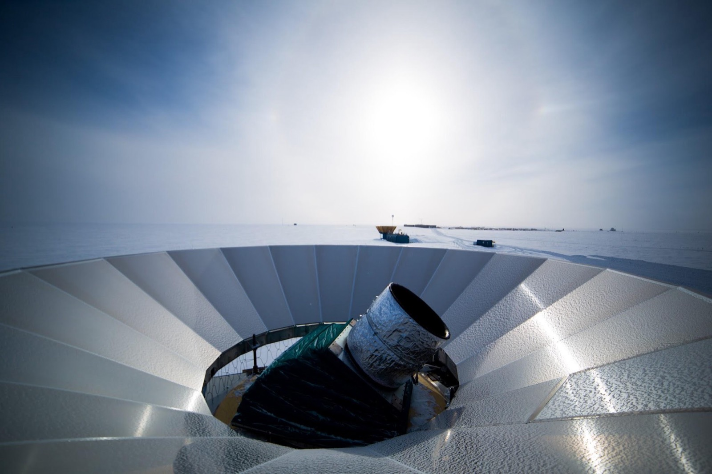

## Invited talks

::: {.dated}
- [July 2026]{.when} [From CMB to Qubits: Shared Frontiers in Superconducting Sensing
  [CECI Workshop on Detector Science, UC Riverside]{.where}]{.what}
- [May 2026]{.when} [SMuRF and SPECTRA: Scalable Warm Electronics for Superconducting Dark
  Matter Sensors [Superconducting Technologies for Dark Matter 2026, Sapienza University of
  Rome]{.where}]{.what}
- [March 2026]{.when} [Updates from the BICEP Inflation Search Program
  [Rencontres de Moriond, Cosmology]{.where}]{.what}
- [January 2026]{.when} [Seminar
  [Pontificia Universidad Católica de Chile]{.where}]{.what}
- [March 2025]{.when} [Physics Colloquium
  [University of Wisconsin–Madison]{.where}]{.what}
- [January 2025]{.when} [Special session
  [2025 National Radio Science Meeting]{.where}]{.what}
- [October 2024]{.when} [PPC 2024
  [Workshop on Particle Physics and Cosmology]{.where}]{.what}
:::

## Other presentations

::: {.dated}
- [August 2026]{.when} [The South Pole Observatory: A Combined Inflation Search Program
  Targeting σ(r) ∼ 0.001 [New Frontiers in Cosmology, A Coruña]{.where}]{.what}
- [July 2026]{.when} [The South Pole Observatory: A Combined Inflation Search Program
  Targeting σ(r) ∼ 0.001 [APS Division of Particles and Fields]{.where}]{.what}
:::

{fig-alt="Eleven people in cold-weather gear posing in front of the four BICEP Array receiver windows."}

## Public lectures

::: {.dated}
- [2020]{.when} [SLAC Public Lecture Series]{.what}
- [2018]{.when} [Viewing the beginning of time from the most remote places on Earth
  [Randall Museum and the San Francisco Amateur Astronomers]{.where}]{.what}
- [2017]{.when} [SLAC Public Lecture Series]{.what}
:::

## Outreach

KIPAC community outreach, 2013–2018 and 2023.

Caltech Classroom Connection, 2006–2010, working with physics teachers at Pasadena High
School and John Marshall Fundamental School.

{fig-alt="A telescope receiver pointing skyward from the center of a large white segmented ground shield, with the low sun and flat snow horizon behind it."}

::: {.todo .content-visible when-profile="draft"}
**TODO.** Press coverage from 2024 to 2026 is missing. The old site's press list stopped in
October 2023; send newer items and a press section will be added here.
:::
