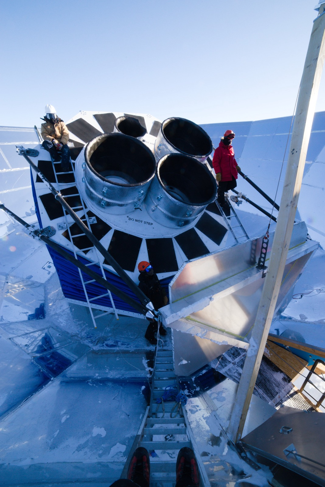
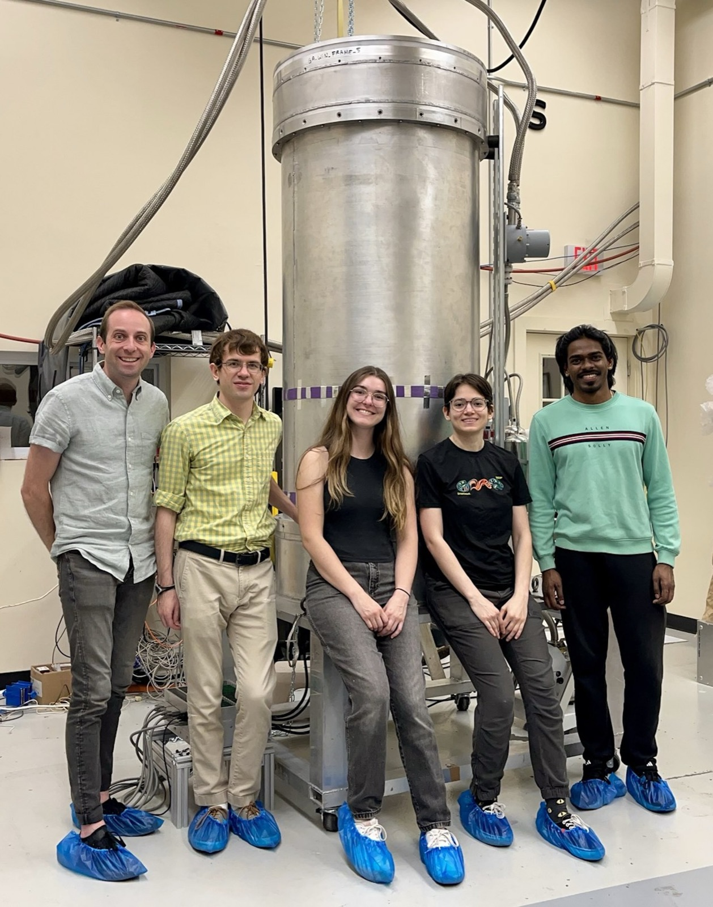
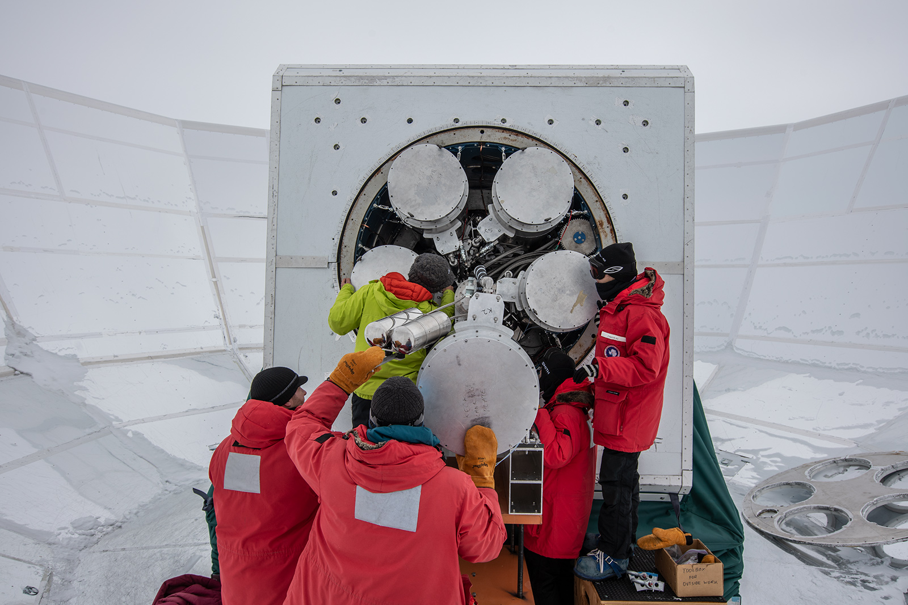
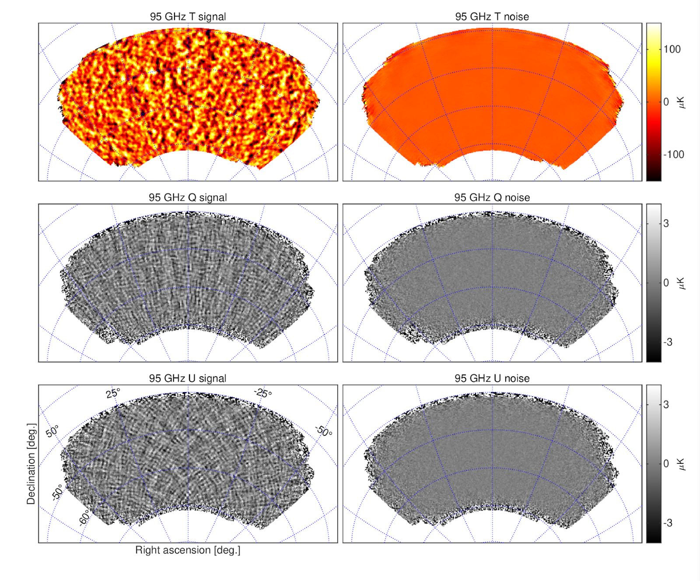
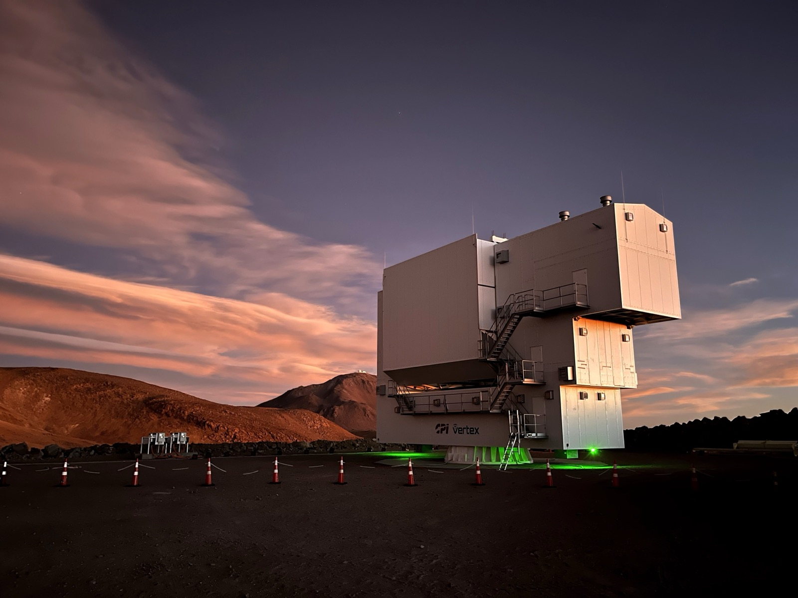
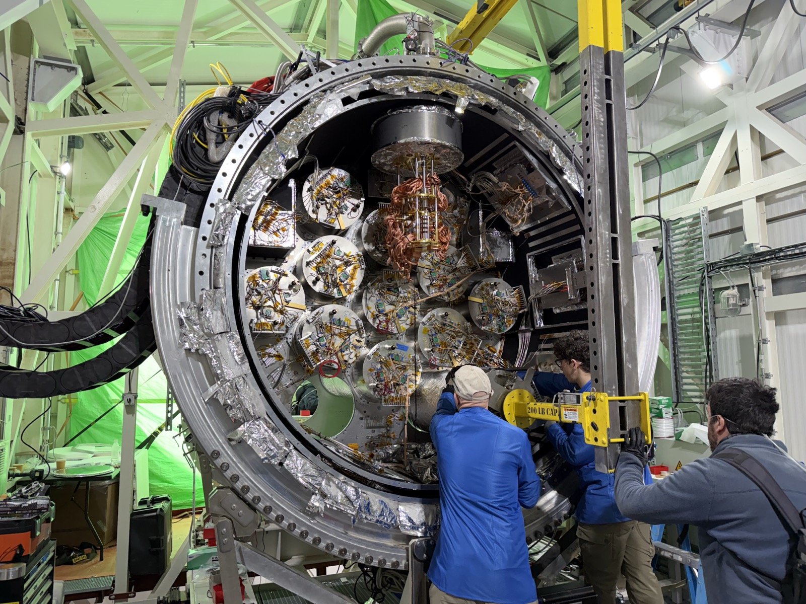

Most of my research asks what happened in the first instant of the Universe, and what the
Universe did afterward. Both questions are answered by measuring the cosmic microwave
background with enough precision, and precision is set by the sensing chain: the detectors,
their readout, and the devices underneath. My group works across that whole stack.

## The first instant

Inflation predicts that the violent expansion of the early Universe left behind a background
of primordial gravitational waves. Those waves would imprint a distinctive curl, a B-mode
pattern, on the polarization of the cosmic microwave background at degree angular scales.
Detecting that pattern would be direct evidence of physics at energies far beyond the reach
of any accelerator.

The [South Pole Observatory](http://bicepkeck.org) is a coordinated observing and analysis
program of the BICEP and SPT collaborations at the Amundsen-Scott South Pole Research
Station, targeting σ(r) = 0.001 on the tensor-to-scalar ratio. Compact small-aperture BICEP
polarimeters integrate deeply on roughly 1% of the sky to search for the primordial signal,
and to disentangle it from Galactic foregrounds in that field.
The 10 meter South Pole Telescope supplies the high-resolution maps of gravitational lensing
used to delens those B-mode data. Lensing of the CMB by intervening structure converts E-mode
polarization into B modes that would otherwise swamp a primordial signal at this level, so
delensing is not a refinement of the measurement but a requirement of it.

{fig-alt="Two people on scaffolding beside the four cylindrical BICEP Array receivers, mounted in a blue-skirted ground shield on the Antarctic plateau."}

I am the DOE principal investigator of the BICEP Array Upgrade Project, populating the fourth
BICEP Array receiver with detector modules before installation and commissioning at the South
Pole. I am also the SLAC principal investigator and Readout L2 manager for SPT-3G+, leading
the microwave SQUID multiplexed readout for a receiver of 24,080 transition-edge sensors at
90 and 150 GHz, planned for installation in early 2029.

{fig-alt="Five people standing beside a tall cylindrical cryostat in a laboratory high bay."}

### Earlier work in this program

{fig-alt="Several people in polar gear working on the open back of a telescope receiver mounted inside a large reflective ground shield, surrounded by snow."}

As a postdoc, I led the design, construction, testing and deployment of BICEP3, which
delivered ten times the optical throughput of the previous generation of BICEP receivers,
from 2011 to 2015. From 2015 to 2018, as Panofsky Fellow at SLAC, I coordinated BICEP/Keck
science observations and oversaw low-level data reduction, map making and data quality
assurance, work that produced the BK18 dataset and its constraint r(0.05) < 0.036 at 95%
confidence. I also supervised the first published
constraints on ultralight axionlike fuzzy dark matter derived from polarization oscillations
in BICEP/Keck data.

{fig-alt="Six sky maps arranged in two columns showing temperature, Q and U polarization signal and noise for a patch of southern sky."}

## How structure grew

The same CMB photons that carry the inflationary signal have traveled through all the
structure that formed after recombination. Gravitational lensing deflects them, and
reconstructing those deflections maps the total matter distribution. Combined with galaxy
surveys, CMB lensing constrains the sum of neutrino masses, the behavior of dark energy,
and the relationship between galaxies and the dark matter halos they occupy.

I pursue this with the [Simons Observatory](https://simonsobservatory.org/), in the Parque
Astronómico de Atacama in northern Chile. The six-meter Large Aperture Telescope achieved
first light in February 2025.
My group built the detector readout electronics for the observatory. I am a co-investigator
on the NSF-funded Advanced Simons Observatory project, leading the SLAC scope for the
expanded observatory's readout system.

{fig-alt="A large boxy telescope enclosure on the Atacama plateau at dusk, lit from below, with pink cloud and dark hills behind it."}

My group is carrying out a comprehensive study of instrument systematic effects on CMB
lensing reconstruction with Large Aperture Telescope data, running from 2025. That includes
readout crosstalk studies that quantify the level of the systematic and propagate it through
map making into the lensing estimator, where its effect on the reconstructed lensing power
can actually be judged. The group also handles source removal, null tests and results
validation for lensing reconstruction with the telescope's Initial Science Observations, with
publications in preparation.

{fig-alt="A large cylindrical cryostat opened to show a ring of foil-wrapped optics tubes, with three people working at its rim."}

## Sensing at the quantum limit

A superconducting sensor is only as useful as the wire that gets its signal out of the
cryostat. Microwave SQUID multiplexing solves that problem by giving every detector its own
superconducting microresonator, so that thousands of channels share one coaxial line and one
cryogenic amplifier. My group developed this technique to a 1000× multiplexing factor for
transition-edge sensor bolometers, and built the [SMuRF electronics](smurf.qmd) that make it
work in a deployed instrument rather than only on a laboratory bench. SMuRF now reads out
98,000 transition-edge sensors at the Simons Observatory, the largest deployment of microwave
SQUID multiplexing for TES bolometers as of 2026, and it is applied to X-ray calorimetry and
to quantum device measurement.

That capability is not specific to the CMB. It applies wherever a superconducting sensor has
to be read out at scale, and much of my current work takes it into other domains.

I lead the photon sensors project in the Sensors for Entanglement thrust of Q-NEXT, from 2025
to 2030, developing high-speed superconducting nanowire single-photon detectors for
entanglement distribution, targeting high detection efficiency and low timing jitter at
telecom wavelengths. I am also the principal investigator of an LDRD program from 2027 to
2029 on high kinetic inductance thin films for amplification, sensing and quantum
information, which extends the same materials platform to low-threshold detectors for dark
matter and rare-event searches. My first experiment was a dark matter search, and the
sensing techniques I have worked on since are finding their way back into that field.

## Devices

Reading out tens of thousands of channels only works if the devices underneath behave
identically enough to be read out together. Transition temperatures, resonator frequency
placement and yield across a silicon wafer decide whether a multiplexer is usable or
collision-riddled, which makes fabrication part of the physics rather than a service to it.
That work is described on the [devices page](devices.qmd).
