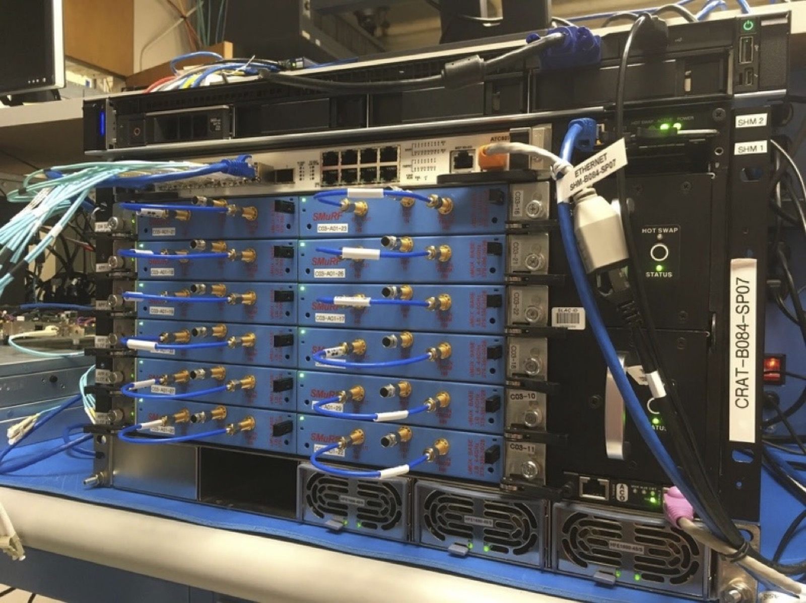
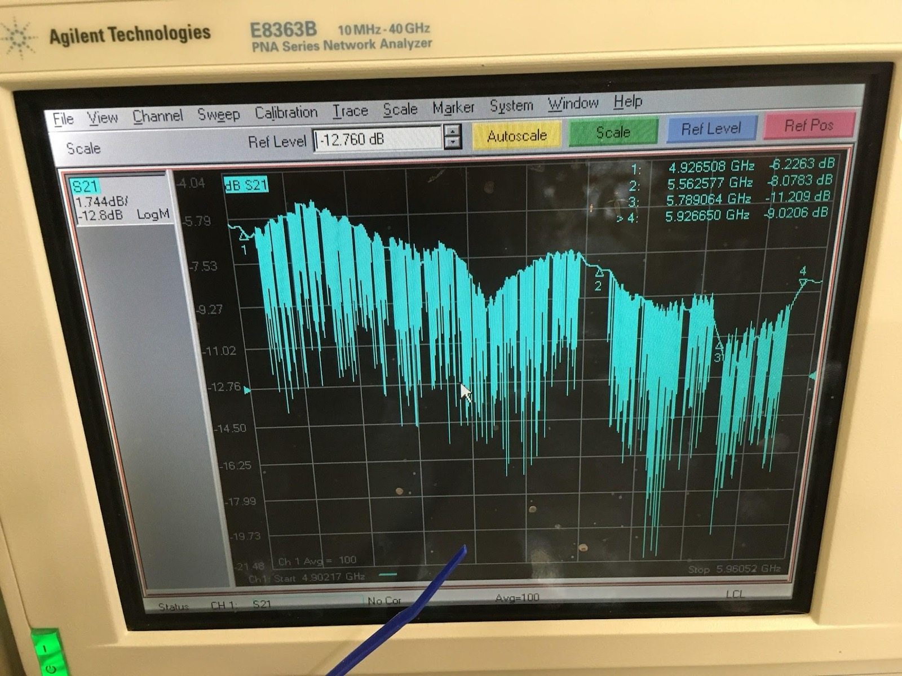
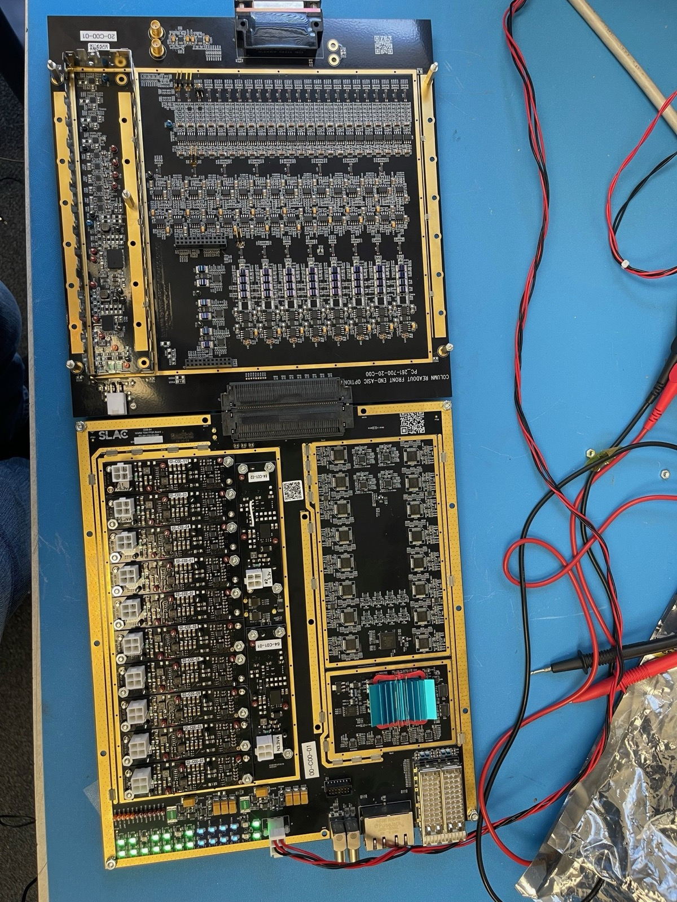
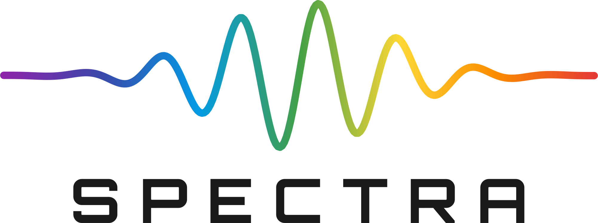
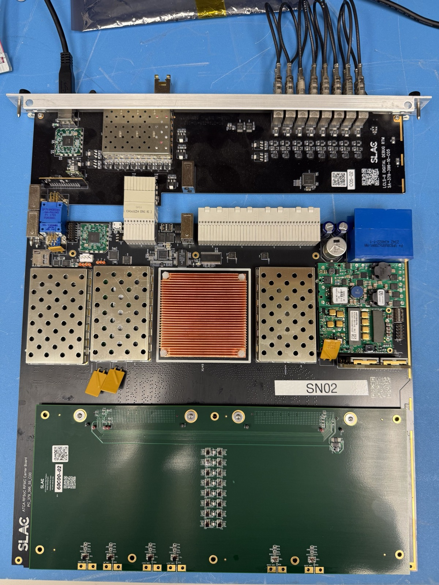

SMuRF, the SLAC Microresonator Radio Frequency electronics, is the warm readout system for
microwave SQUID multiplexed superconducting sensors. Each detector is coupled to its own
superconducting microresonator with a distinct resonant frequency. A single coaxial line
carries a comb of microwave probe tones past all of them, and the readout job is to generate
that comb, follow what each resonator does to its tone, and turn the result back into a
detector timestream. SMuRF does this in warm digital electronics, and the specific thing it
does differently is track.

{fig-alt="A rack-mounted crate holding six blue circuit cards, each with gold coaxial connectors and blue semi-rigid cables running to the left."}

## Tone tracking

A conventional readout parks a fixed tone at each resonance. That works until the detector
responds: as the sensor's inductance changes, its resonance moves, and the fixed tone slides
down the side of the dip. The signal then appears as a large amplitude swing on a tone that
is no longer where it should be.

{fig-alt="A network analyzer screen showing a microwave transmission trace with dozens of sharp downward resonance dips across a frequency span of about one gigahertz."}

The cost of that is paid in the cryogenic amplifier. Every tone in the comb passes through
the same first-stage amplifier at once, and the amplifier has to carry all of them
simultaneously without driving itself into a regime where the tones intermodulate and
generate spurious products on top of real channels. The limit is total power, so the dynamic
range each channel demands sets how many channels can share the line. This, rather than
anything about the resonators themselves, is the practical bottleneck on multiplexing factor.

SMuRF instead measures where each resonance has moved and steers the drive tone to follow it.
Because the tone stays on resonance, the amplitude excursion the amplifier chain has to carry
stays small, and the detector signal is recovered from the frequency correction rather than
from the amplitude. Lowering the dynamic range requirement per channel is what allows the
channel count to grow. My group developed the technique to a 1000× multiplexing factor for
transition-edge sensor bolometers, and demonstrated a 1820-channel multiplexer with NIST
Boulder in 2025.

The resonator chip designs themselves are the work of NIST Boulder. SMuRF is the warm
electronics and the algorithms that drive them.

## Where it runs

My group designed, prototyped, validated, fabricated and delivered the SMuRF warm readout
electronics for the Simons Observatory cameras, and for the readout system of the Advanced
Simons Observatory expansion. SMuRF reads out 98,000 transition-edge sensors at the Simons
Observatory, which as of 2026 is the largest deployment of microwave SQUID multiplexing for
TES bolometers anywhere. The same electronics are in use for X-ray calorimetry and for
quantum device measurement.

{fig-alt="Two mated circuit boards on a bench, one dense with gold-shielded RF sections and one carrying the digital processing electronics."}

## Beyond the CMB

::: {.logo}
{fig-alt="SPECTRA logo"}
:::

Nothing about tone tracking is specific to millimeter-wave astronomy. Any experiment that
needs to read many superconducting sensors through a limited number of cold lines faces the
same amplifier dynamic range problem, and dark matter, neutrino and quantum information
experiments increasingly do.

SPECTRA is an open-source RFSoC-based readout platform developed with Fermilab and the
University of Chicago that pairs SMuRF tone tracking with QICK firmware. The combination
spans two regimes that are usually served by different instruments: high channel density
resonator arrays on one side, and MHz-bandwidth readout of individual quantum sensors on the
other. It is intended for future CMB and submillimeter surveys alongside dark matter
searches, coherent elastic neutrino-nucleus scattering experiments, and rare-event searches.

{fig-alt="An RFSoC-based readout board on a blue bench mat, with shielded RF sections, a large copper heatsink and a row of coaxial connectors along the front panel."}

If you are reading this from the dark matter or quantum sensing side, the practical summary
is that the hard engineering of scaling superconducting sensor readout has largely been done
and is available to you. The warm electronics are built, the firmware is open, and the
technique has operated continuously on a deployed instrument with tens of thousands of
channels for years.

## Selected references

::: {.refs}
- Yu, C. et al. [*SLAC microresonator RF (SMuRF) electronics: A tone-tracking readout system
  for superconducting microwave resonator arrays.*](https://doi.org/10.1063/5.0125084)
  Review of Scientific Instruments **94**, 014712 (2023).
- Groh, J. C. et al. [*Demonstration of a 1820 channel multiplexer for transition-edge sensor
  bolometers.*](https://doi.org/10.1063/5.0290914) Applied Physics Letters **127**, 152602
  (2025).
- Groh, J. C. et al. [*Crosstalk Effects in Microwave SQUID Multiplexed TES Bolometer Readout.*](https://doi.org/10.1007/s10909-024-03126-w) Journal of Low Temperature
  Physics (2024).
- Henderson, S. W. et al. [*Highly-multiplexed microwave SQUID readout using the SLAC
  Microresonator Radio Frequency (SMuRF) electronics for future CMB and sub-millimeter
  surveys.*](https://doi.org/10.1117/12.2314435) Proc. SPIE **10708**, 1070819 (2018).
- Kernasovskiy, S. A. et al. [*SLAC Microresonator Radio Frequency (SMuRF) Electronics for
  Read Out of Frequency-Division-Multiplexed Cryogenic
  Sensors.*](https://doi.org/10.1007/s10909-018-1981-5) Journal of Low Temperature Physics
  **193**, 570 (2018).
- Liu, C. et al. [*Development of RFSoC-based direct sampling highly multiplexed microwave SQUID
  readout for CMB and submillimeter surveys.*](https://doi.org/10.1117/12.3019317) Proc. SPIE **13102**,
  1310211 (2024).
:::
