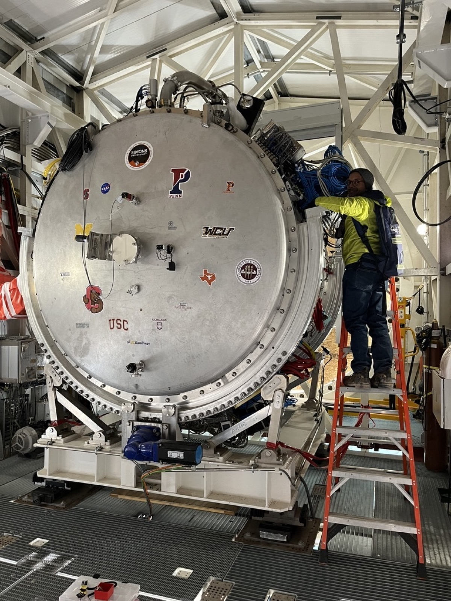

The same CMB photons that carry the inflationary signal have traveled through all the
structure that formed after recombination. Gravitational lensing deflects them, and
reconstructing those deflections maps the total matter distribution. Combined with galaxy
surveys, CMB lensing constrains the sum of neutrino masses, the behavior of dark energy,
and the relationship between galaxies and the dark matter halos they occupy.

Lensing is not the only thing the CMB picks up on the way. The Sunyaev Zeldovich effects
record the hot gas the photons pass through: the thermal effect tracks the pressure of
electrons in that gas, and the kinetic effect their bulk momentum. Together with lensing
they turn the CMB into a probe of where the matter is, how hot it is, and how it is moving,
which is a different and complementary handle on structure formation from the one galaxy
surveys provide.

## The Simons Observatory

I pursue this with the [Simons Observatory](https://simonsobservatory.org/), in the Parque
Astronómico de Atacama in northern Chile. The six-meter Large Aperture Telescope achieved
first light in February 2025. My group built the detector readout electronics for the
observatory. I am a co-investigator on the NSF-funded Advanced Simons Observatory project,
leading the SLAC scope for the expanded observatory's readout system.

{fig-alt="A large boxy telescope enclosure on the Atacama plateau at dusk, lit from below, with pink cloud and dark hills behind it."}

A large-aperture telescope is what lensing reconstruction requires. The deflections being
measured are small and correlated on arcminute scales, so the instrument has to resolve
them, which is why this measurement needs a six-meter dish where the inflation search at
the [South Pole](inflation.qmd) can use compact refractors. It also has to cover a wide
enough area of sky for the statistics to be worth having, which sets the scale of the
camera and, in turn, of its readout.

{fig-alt="A large cylindrical cryostat opened to show a ring of foil-wrapped optics tubes, with three people working at its rim."}

{fig-alt="A large cylindrical cryostat end cap covered in university and institution stickers, with a person on a step ladder working at its far side."}

## What my group is doing with the data

My group is carrying out a comprehensive study of instrument systematic effects on CMB
lensing reconstruction with Large Aperture Telescope data, running from 2025. That includes
readout crosstalk studies that quantify the level of the systematic and propagate it through
map making into the lensing estimator, where its effect on the reconstructed lensing power
can actually be judged. The group also handles source removal, null tests and results
validation for lensing reconstruction with the telescope's Initial Science Observations,
with publications in preparation.

Crosstalk is a good example of why building the readout and doing the analysis in the same
group is useful. A small amount of signal leaking between multiplexed channels is an
instrumental effect with a known origin in the hardware, but whether it matters depends
entirely on how it propagates through map making into a quadratic estimator that is itself
built from products of the map. The question cannot be answered from either end alone.

Group members also work on the large-scale structure science these maps feed:
cross-correlations between CMB lensing and galaxy surveys, and millimeter-wave line
intensity mapping as a route to structure at higher redshift than galaxy catalogs reach.

## Recent result

Jia 'Frank' Qu and colleagues published unified and consistent structure growth measurements
from joint ACT, SPT and Planck CMB lensing in *Physical Review Letters* **136**, 021001
(2026), [doi:10.1103/k5yr-3h6d](https://doi.org/10.1103/k5yr-3h6d). Combining the lensing
measurements from three experiments into one consistent analysis is the kind of result that
sets the baseline the Simons Observatory data will be measured against.

::: {.todo .content-visible when-profile="draft"}
**TODO, drafted text to check.** Written by me rather than taken from your material, so
check or cut: the Sunyaev Zeldovich paragraph in the opening, **A large-aperture telescope
is what lensing reconstruction requires**, the paragraph on why crosstalk needs both ends,
the sentence on group members' cross-correlation and line intensity mapping work, and the
framing of the Qu result. The underlying facts come from your CV and the build brief, but
the connective argument is mine.
:::
